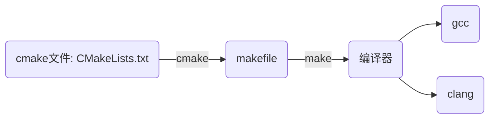
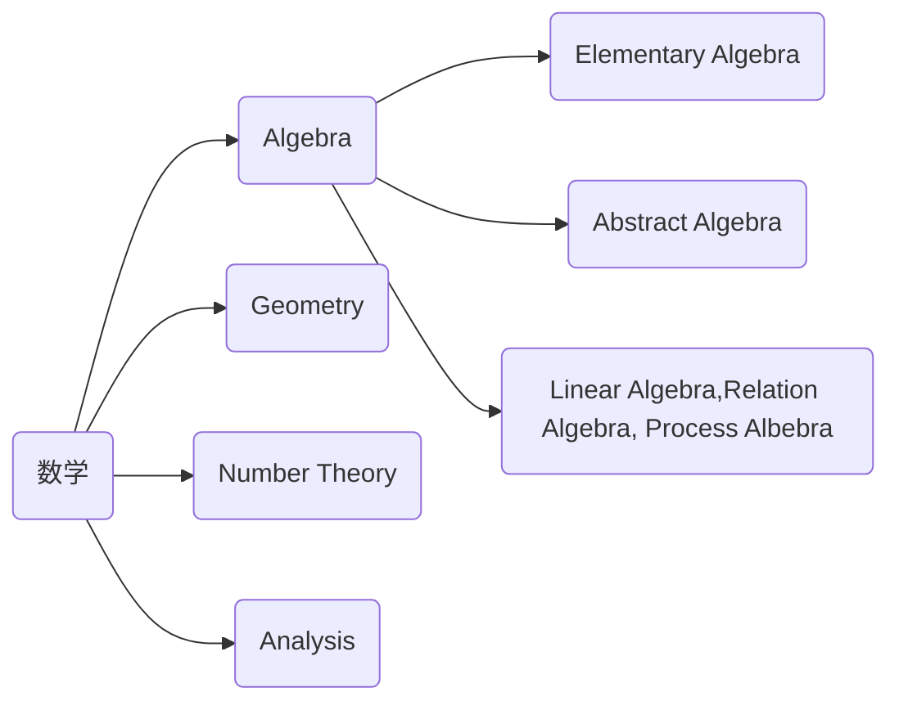

## 21/9/8 Wed.

- 408-数据结构与算法-天勤7.4 散列表
- 408-数据结构与算法-天勤7.3 B树

## 21/9/10 Fri.

- 数据库-索引和B+树

## 21/9/12 Sun.

- [数据库](https://www.zhihu.com/question/273489729/answer/382181550) -[关系代数](https://www.cnblogs.com/lsqin/p/9342923.html)  

## 21/9/20 Mon.

1. cmake够用指北

- [ cmake_Ninsun的博客-CSDN博客](https://blog.csdn.net/github_18974657/category_11182071.html)
- [Quick CMake tutorial | CLion (jetbrains.com)](https://www.jetbrains.com/help/clion/quick-cmake-tutorial.html#seealso)

## 21/9/22 Wed.

1. 形式语言与自动机

---

## 21/10/10 Sun.

- 雅思单词
- CSP第一章、第一章作业

## 21/10/11 Mon.

风雨，降温，24摄氏度

## 21/10/25 Mon.

> 早上上课，下午午睡起来图书馆看书，吃了正门外米粉，买水果。挑新鲜的水果，水果店家庭员工一直跟着我，不知道是怕我偷水果还是怎的。但我就慢慢地挑，被水果店（就是这家）有意无意坑了好几次，终于量变引起质变——我开窍了，掌握了挑水果的经验和脸皮厚度（我妈知道一定会很欣慰的）。新鲜的水果，剥去包装，仔细查看是否有破损（破损虽不一定不新鲜，但大多不新鲜；而不破损虽不一定新鲜，但大多新鲜）；挑葡萄时，如果肉眼不能辨别是否新鲜，那就摸摸（此点适用于大多数水果），此外茎枝的新鲜程度也可看出。
>
> 或者是慢下来的节奏让我有了底气，慢慢地，享受地，好好地做成一件事。
>
> 晚上跑步，洗澡回来打王者

## 21/10/26 Tues.

> WHY NOT? 有何不可

---

## 21/11/04 Thur.

- IEEE Xplore 数据库搜索挑战赛10题
- 利用Xray完成科学上网

## 21/11/05 Fri.

- 完成Xray经验Blog

## 21/11/08 Mon.

- 海底光缆

拖延着干不相干的事情就是快乐。

## 21/11/15 Mon.

- 1984：反极权主义，涂改过去、控制思想、消灭人欲、删改语言，金字塔形。政治经济学-社会生产力-为什么、怎么样。简单客观真实的自由 - 历史舆论认知

## 21/11/16 Tues.

- 人大选举
- 动物农场：反极权主义，偏向改朝换代，统治者和被统治者

## 21/11/17 Wed.

- 毕业论文意向书
- 实验室工位：DVI线- DVI线

## 21/11/18 Fri.

- Duckduckgo - On the Internet, nobody knows you are a dog ...
- Edge 安装 google store 扩展

- ?- Java - [重写(overwrite)、重载(overload)和覆盖(override)三者之间的区别](https://www.cnblogs.com/bob-wzb/p/7278213.html)
- ?- 网站链接长期有效性问题

## 21/11/21 Sun.

- LaTeX

## 21/11/23 Tues.

- 认清现实，放弃幻想

## 21/11/20 Mon.

- 整理了知乎收藏夹：动态 - 最近；收藏夹 - 收藏

- homebrew

  > brew list
  >
  > brew info *
  >
  > brew install *

- homebrew安装了python
  - Python2 - /System/Library/Frameworks/Python.framework/
  
  - Python3 - Python3.8.9 -  /Library/Developer/CommandLineTools/Library/Frameworks/Python3.framework/
  
    > pip20.2.3 - /Library/Developer/CommandLineTools/Library/Frameworks/Python3.framework/Versions/3.8/lib/python3.8/site-packages/pip
  
  - Python3.9.6 - /opt/homebrew/cellar/python@3.9/3.9.6/Frameworks/Python.framework/Versions/3.9/bin
  
    > homebrew
    >
    > pip 21.1.3 - /opt/homebrew/cellar/python@3.9/3.9.6/Frameworks/Python.framework/Versions/3.9/bin 
    >
    > packages installed in `/opt/homebrew/lib/python3.9/site-packages/pip`

## 21/12/3 Fri.

- English-Self-Introduction:
- Zelda Liang（梁子凡）Joined QAD as SE intern on December 8th, 2021.
- Zelda is a student of East China Normal University. She is now in her fourth year pursuing a Bachelor of Software Engineering.  With an overall understanding of Data Structure, Computer Network, Operating System (such as Linux System), she is especially good at coding in  C++ and Java. She also has plenty of experience in developing Web program with SpringBoot architecture.
- Zelda could gets lots of pleasure in trying new things. In her spare time, she likes playing Glory of Kings and listening to music. She also like to exercise to keep fit.

　
