### To-dos
- [ ] 域名
- [x] 在线ssh
- [ ] 在线C++编译器
- [x] 在线博客系统
- [x] docker
- [x] 浏览器文件/FTP服务器
- [ ] PHP+MySQL
- [ ] SpringBoot

### links
> [C++ 项目](https://www.zhihu.com/question/280881677/answer/1667822681) | [C++ & Linux学习资源，助你备战秋招](https://leetcode-cn.com/circle/discuss/RfIvhZ/)
>[CMU: linux-bootcamp](http://www.cs.cmu.edu/afs/cs/academic/class/15213-s19/www/activities/linux-bootcamp/linux-bootcamp.pdf) | [Kuangshen](https://mp.weixin.qq.com/mp/homepage?__biz=Mzg2NTAzMTExNg==&hid=2&sn=1650b6338f6469ca519b080fdbbbd333) | [Linux ppt](https://stuecnueducn-my.sharepoint.com/:f:/g/personal/10162100139_stu_ecnu_edu_cn/EhFNYZH3uNZMgWy1nj7dD_sBSNKD3CpnOvaX9DozLIz-EA?e=LiRATa)
> [tlanyan-Linux 发行版本](https://tlanyan.pp.ua/how-to-choose-linux-distributions/) | [tlanyan-linux非root用户安装软件入门](https://tlanyan.pp.ua/work-with-linux-without-root-permission/)

---

## 服务器初始化
> 服务器组合：[LAMP/LNMP](https://zhuanlan.zhihu.com/p/337082614)
 1. 重置密码
 2. 安全组规则，设置端口`入规则：443，21，22，80`
 3. 公网地址，用户名，重置密码
 4. 搭建初始环境（~~宝塔~~）
[SSH](https://cloud.tencent.com/developer/article/1698797?from=information.detail.linux%E6%9F%A5%E7%9C%8Bssh%E7%89%88%E6%9C%AC): 服务端：openSSH; 客户端：MobaXterm/Xshell
 文件：FTP/SFTP
 git
 5. 域名备案
- DNS解析
> - 域名解析服务商->DNSPOD
> - 解析记录：IP地址 | SSL证书：[申请证书](https://cloud.tencent.com/document/product/400/4142#ManualVerification)-[部署证书](https://cloud.tencent.com/document/product/400/4143)-[端口问题](https://www.cnblogs.com/franson-2016/p/5533791.html)

## Websites

```plantuml
@startsalt
{
    {T
     + Nginx
     ++ Wordpress
     ++ Docker
     +++ CodiMD
     +++ GateOne 
    }
}
@endsalt

```


### ftp `ftp://fanloe.space`

### Wordpress博客-LNMP
[基于 CentOS 搭建 WordPress 个人博客](https://cloud.tencent.com/developer/labs/lab/10001) `http://fanloe.space/wordpress`
[手动搭建 WordPress 个人站点（Linux）](https://cloud.tencent.com/document/product/213/8044)
### CodiMD-Docker
[codimd ref-1](https://www.cnblogs.com/misterchaos/p/12799168.html) | [codimd ref-2](https://blog.csdn.net/SuanCaiyu1806/article/details/107522305) `http://fanloe.space:3000`
### GateOne WebSSH-Docker
[GateOne](https://blog.csdn.net/a112626290/article/details/107467445) `https://fanloe.space:5000`

### 服务器定时备份数据库
[服务器定时备份](https://cloud.tencent.com/developer/article/1556436)
1. [服务器备份](https://www.jianshu.com/p/c3d8366326c1)`mysqldump`
2. [服务器发送邮件](https://www.linuxtop.cn/command/mailx.html)`mailx`
[云服务器解封25端口](https://cloud.tencent.com/document/product/213/40436?from=10680)
3. [服务器定时任务](https://www.cnblogs.com/ftl1012/p/crontab.html)`crontab`

```bash=
crontab -e
vim /etc/mail.rc
echo 'mail content' | mailx -s 'mail theme' -a file.txt xx_xx@xx.com
```

### FRP
[使用frp进行内网穿透](https://sspai.com/post/52523) `7000` `7001` 

[frp监控](http://1.15.229.207:7500) `7500` 

#### VPS `45.32.69.168`

