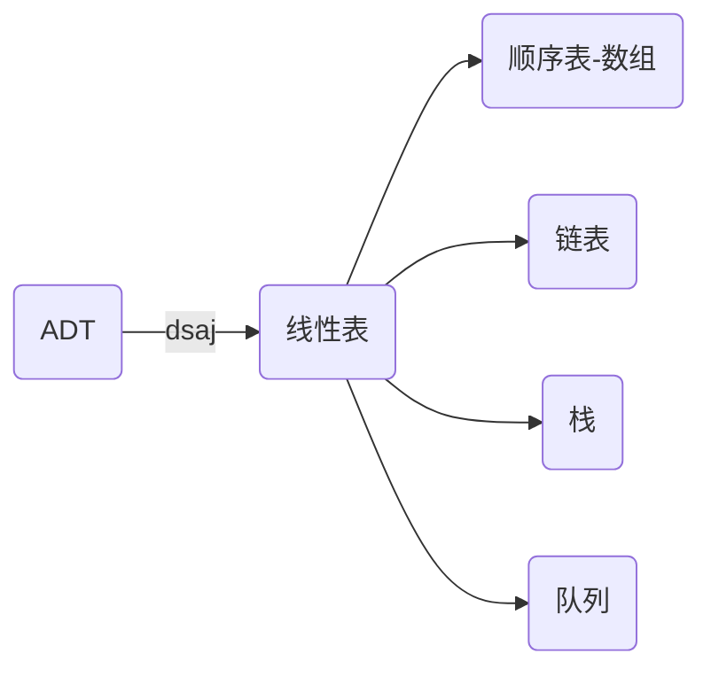
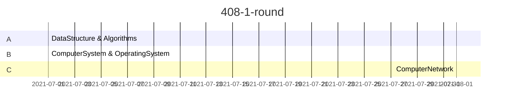
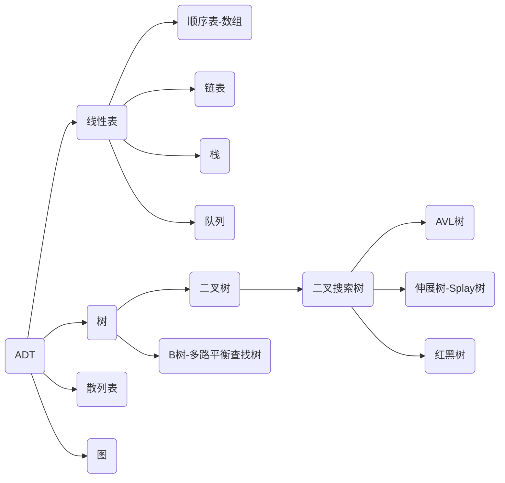
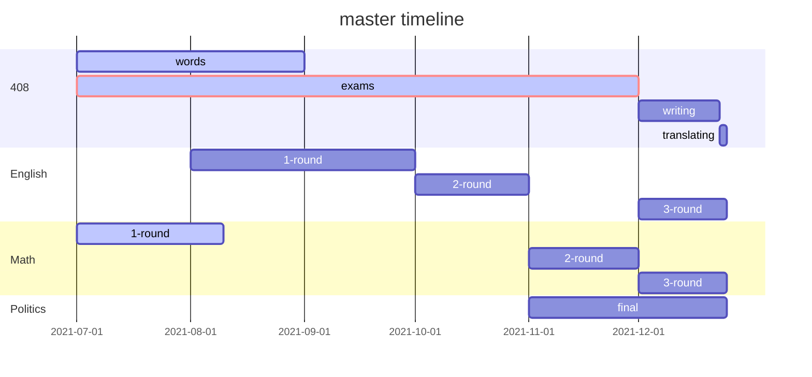

```mermaid
graph LR;
R(ADT)-- dsaj -->A(线性表);
  A-->S(顺序表-数组);
  A-->L(链表);
  A-->St(栈);
  A-->Q(队列);
```

```mermaid
gantt
    title 408-1-round
    
    section A
    DataStructure & Algorithms:active,2021-07-01,2021-08-10
    
    section B
    ComputerSystem & OperatingSystem:crit,active,2021-07-01,2021-08-01
    
    section C
    ComputerNetwork:2021-08-01,2021-08-10

```

```mermaid

graph LR;
R(ADT)-->A(线性表);
  A-->S(顺序表-数组);
  A-->L(链表);
  A-->St(栈);
  A-->Q(队列);
R-->H(树);
  H-->B(二叉树);
    B-->BST(二叉搜索树);
      BST-->AVL(AVL树);
      BST-->Splay(伸展树-Splay树);
      BST-->RB(红黑树);
  H-->Btree(B树-多路平衡查找树);
R-->Hash(散列表);
R-->O(图);

```

```mermaid
gantt
    dateFormat YYYY-MM-DD
    title master timeline

    section English
    words    :active, 2021-07-01, 62d
    exams    :crit,active,englishTask1,2021-07-01,2021-12-01
    writing    :englishTask2,after englishTask1, 2021-12-23
    translating    :after englishTask2,2021-12-25
    
    section Math
    1-round    :2021-08-01,2021-10-01
    2-round    :2021-10-01,2021-11-01
    3-round    :2021-12-01,2021-12-25
    
    section 408
    1-round    :active,2021-07-01,2021-08-10
    2-round    :2021-11-01,2021-12-01
    3-round    :2021-12-01,2021-12-25
    
    section Politics
    final    :2021-11-01,2021-12-25
```